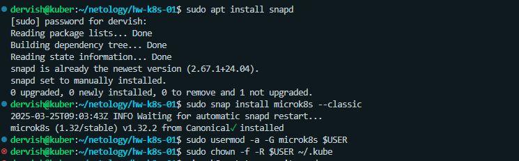
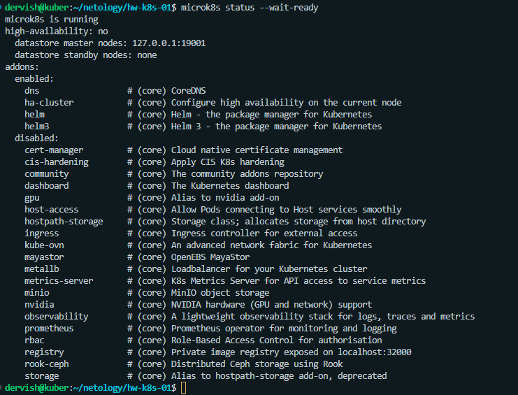
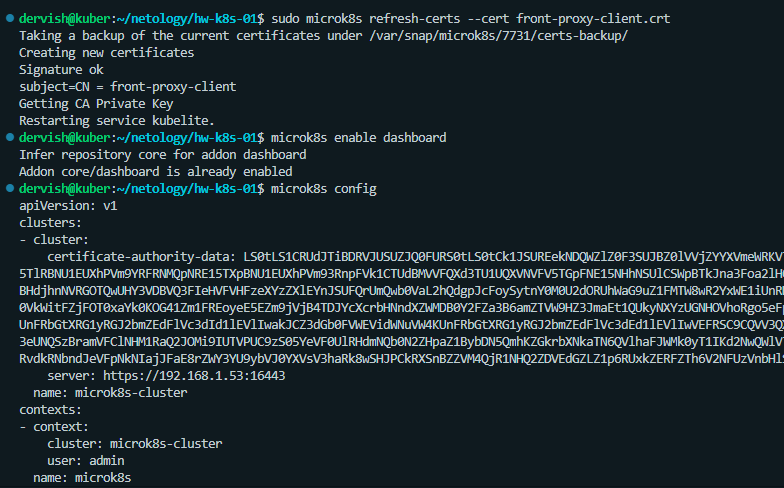

# Домашнее задание к занятию «Kubernetes. Причины появления. Команда kubectl»

## Цель задания

Для экспериментов и валидации ваших решений вам нужно подготовить тестовую среду для работы с Kubernetes. Оптимальное решение — развернуть на рабочей машине или на отдельной виртуальной машине MicroK8S.

## Чеклист готовности к домашнему заданию

    Личный компьютер с ОС Linux или MacOS
    
или
    
    ВМ c ОС Linux в облаке либо ВМ на локальной машине для установки MicroK8S

## Задание 1. Установка MicroK8S

Установить MicroK8S на локальную машину или на удалённую виртуальную машину.

## Задание 2. Установка и настройка локального kubectl

Установить на локальную машину kubectl.

