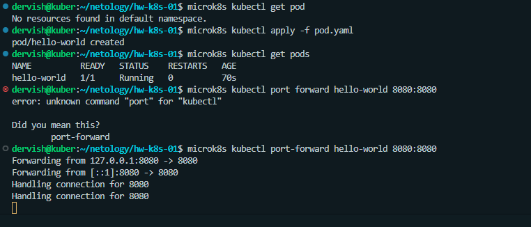
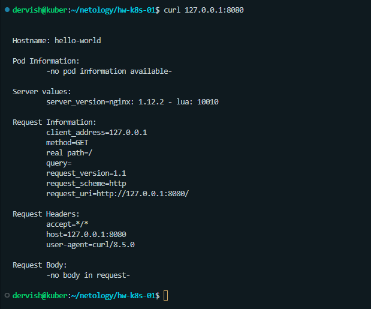
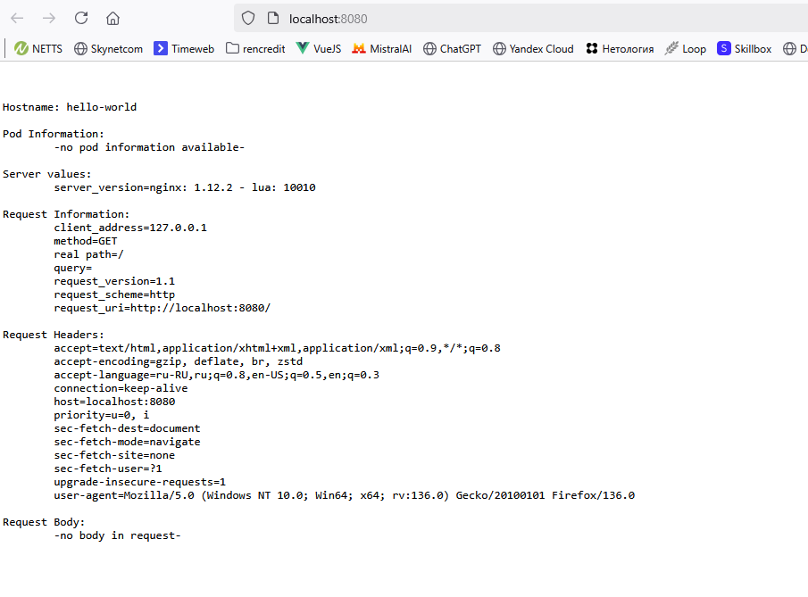
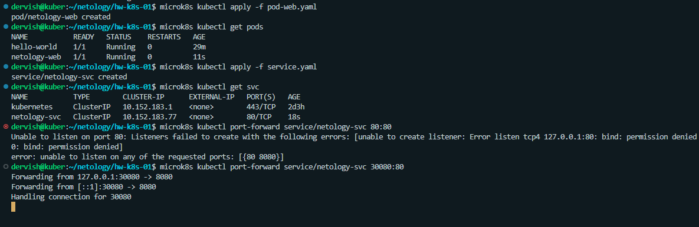
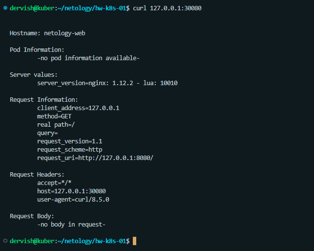

# Домашнее задание к занятию «Базовые объекты K8S»

## Цель задания

В тестовой среде для работы с Kubernetes, установленной в предыдущем ДЗ, необходимо развернуть Pod с приложением и подключиться к нему со своего локального компьютера.

## Чеклист готовности к домашнему заданию

    Установленное k8s-решение (например, MicroK8S).
    Установленный локальный kubectl.
    Редактор YAML-файлов с подключенным Git-репозиторием.

## Задание 1. Создать Pod с именем hello-world

1. Создать манифест (yaml-конфигурацию) Pod.
2. Использовать image - gcr.io/kubernetes-e2e-test-images/echoserver:2.2

>Ответ: [pod.yaml](./pod.yaml)

3. Подключиться локально к Pod с помощью kubectl port-forward и вывести значение (curl или в браузере).

## Задание 2. Создать Service и подключить его к Pod

1. Создать Pod с именем netology-web.
2. Использовать image — gcr.io/kubernetes-e2e-test-images/echoserver:2.2.

>Ответ: [pod-web.yaml](./pod-web.yaml)

3. Создать Service с именем netology-svc и подключить к netology-web.

>Ответ: [service.yaml](./service.yaml)

4. Подключиться локально к Service с помощью kubectl port-forward и вывести значение (curl или в браузере).

