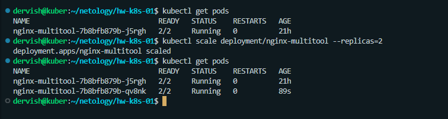
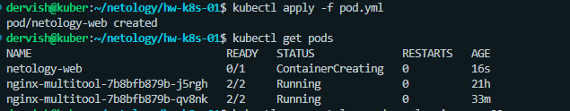
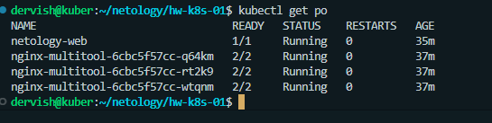
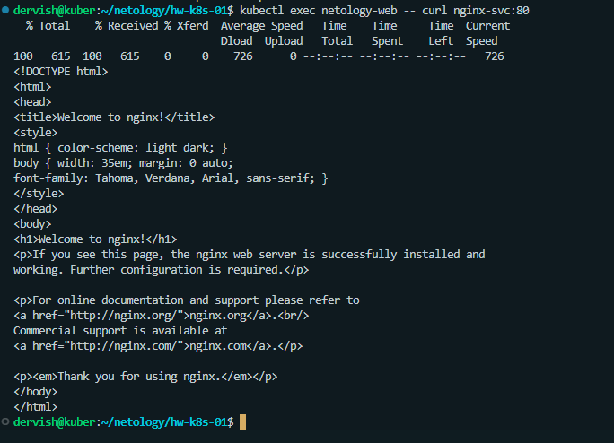

# Домашнее задание к занятию «Запуск приложений в K8S»

## Цель задания

В тестовой среде для работы с Kubernetes, установленной в предыдущем ДЗ, необходимо развернуть Deployment с приложением, состоящим из нескольких контейнеров, и масштабировать его.

## Чеклист готовности к домашнему заданию

    Личный компьютер с ОС Linux или MacOS

или
    
    ВМ c ОС Linux в облаке либо ВМ на локальной машине для установки MicroK8S

## Задание 1. Создать Deployment и обеспечить доступ к репликам приложения из другого Pod

Создать Deployment приложения, состоящего из двух контейнеров — nginx и multitool. Решить возникшую ошибку.

>Ответ: [deploy.yml](./deploy.yml)

После запуска увеличить количество реплик работающего приложения до 2.
Продемонстрировать количество подов до и после масштабирования.

Создать Service, который обеспечит доступ до реплик приложений из п.1.

>Ответ: [service.yml](./service.yml)

Создать отдельный Pod с приложением multitool и убедиться с помощью curl, что из пода есть доступ до приложений из п.1.

## Задание 2. Создать Deployment и обеспечить старт основного контейнера при выполнении условий

