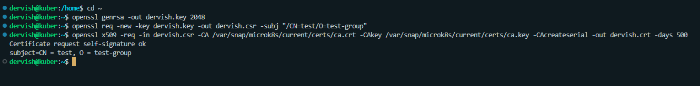
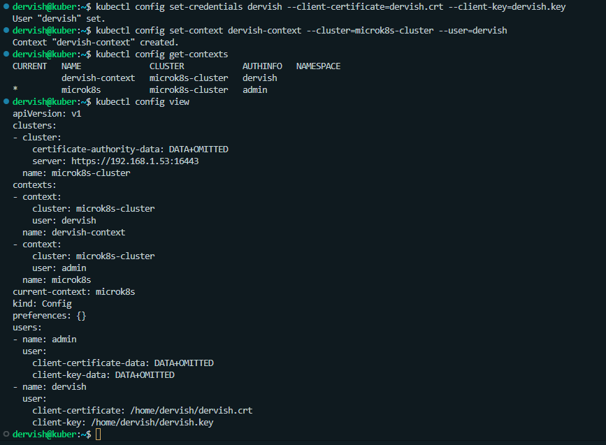
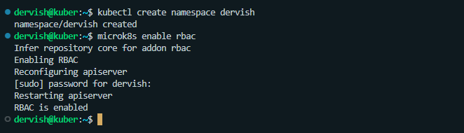
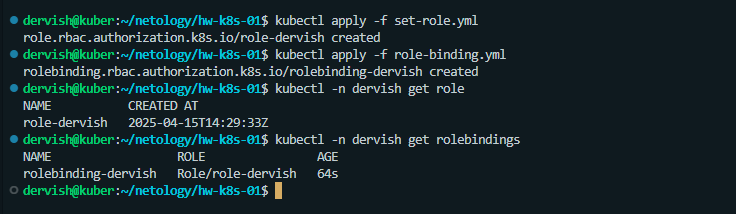
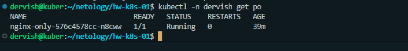
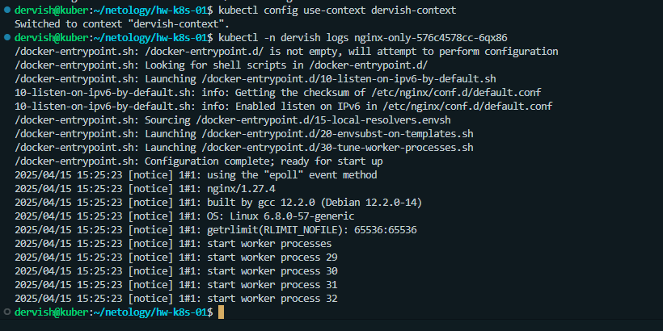
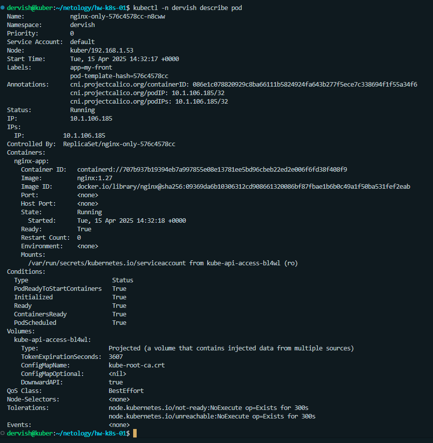
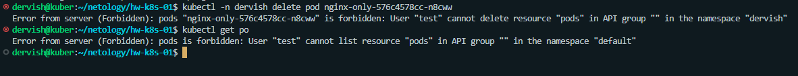

# Домашнее задание к занятию «Управление доступом»

## Цель задания

В тестовой среде Kubernetes нужно предоставить ограниченный доступ пользователю.

## Чеклист готовности к домашнему заданию

    Установленное k8s-решение (например, MicroK8S).
    Установленный локальный kubectl.
    Редактор YAML-файлов с подключённым Git-репозиторием.

## Задание 1. Создайте конфигурацию для подключения пользователя

1. Создайте и подпишите SSL-сертификат для подключения к кластеру.

2. Настройте конфигурационный файл kubectl для подключения.

3. Создайте роли и все необходимые настройки для пользователя.

4. Предусмотрите права пользователя. Пользователь может просматривать логи подов и их конфигурацию (kubectl logs pod <pod_id>, kubectl describe pod <pod_id>).

Предоставить манифесты, а также скриншоты или вывод необходимых команд.

>Ответ: [deploy.yml](./deploy.yml) [set-role.yml](./set-role.yml) [role-binding.yml](./role-binding.yml)
