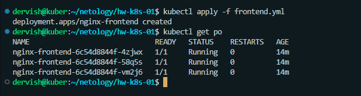
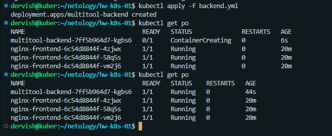
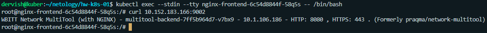
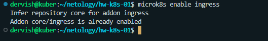
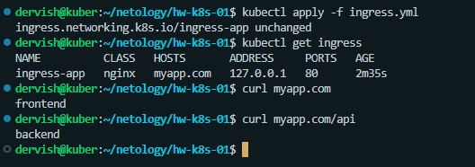

# Домашнее задание к занятию «Сетевое взаимодействие в K8S. Часть 2»

## Цель задания

В тестовой среде Kubernetes необходимо обеспечить доступ к двум приложениям снаружи кластера по разным путям.

## Чеклист готовности к домашнему заданию

    Установленное k8s-решение (например, MicroK8S).
    Установленный локальный kubectl.
    Редактор YAML-файлов с подключённым Git-репозиторием.

## Задание 1. Создать Deployment приложений backend и frontend

Создать Deployment приложения frontend из образа nginx с количеством реплик 3 шт.

>Ответ: [frontend.yml](./frontend.yml)

Создать Deployment приложения backend из образа multitool.

>Ответ: [backend.yml](./backend.yml)

Добавить Service, которые обеспечат доступ к обоим приложениям внутри кластера.

>Ответ: [service.yml](./service.yml)

Продемонстрировать, что приложения видят друг друга с помощью Service.

Предоставить манифесты Deployment и Service в решении, а также скриншоты или вывод команды п.4.

>Ответ: [frontend.yml](./frontend.yml)  [backend.yml](./backend.yml) [service.yml](./service.yml)

## Задание 2. Создать Ingress и обеспечить доступ к приложениям снаружи кластера

Включить Ingress-controller в MicroK8S.

Создать Ingress, обеспечивающий доступ снаружи по IP-адресу кластера MicroK8S так, чтобы при запросе только по адресу открывался frontend а при добавлении /api - backend.

>Ответ: [ingress.yml](./ingress.yml)

Продемонстрировать доступ с помощью браузера или curl с локального компьютера.

Предоставить манифесты и скриншоты или вывод команды п.2.

>Ответ: [hello.yml](./hello.yml) [api.yml](./api.yml) [service-hello.yml](./service-hello.yml) [service-api.yml](./service-api.yml) [ingress.yml](./ingress.yml)