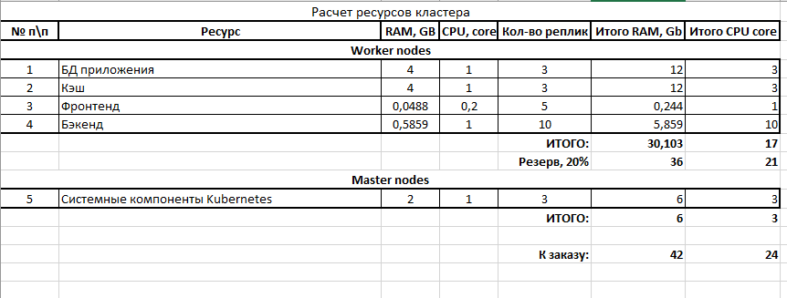

# Домашнее задание к занятию «Компоненты Kubernetes»

## Цель задания

Рассчитать требования к кластеру под проект

## Задание. Необходимо определить требуемые ресурсы

Известно, что проекту нужны база данных, система кеширования, а само приложение состоит из бекенда и фронтенда. Опишите, какие ресурсы нужны, если известно:

    Необходимо упаковать приложение в чарт для деплоя в разные окружения.
    База данных должна быть отказоустойчивой. Потребляет 4 ГБ ОЗУ в работе, 1 ядро. 3 копии.
    Кеш должен быть отказоустойчивый. Потребляет 4 ГБ ОЗУ в работе, 1 ядро. 3 копии.
    Фронтенд обрабатывает внешние запросы быстро, отдавая статику. Потребляет не более 50 МБ ОЗУ на каждый экземпляр, 0.2 ядра. 5 копий.
    Бекенд потребляет 600 МБ ОЗУ и по 1 ядру на копию. 10 копий.

>Ответ: все расчеты сведены в таблицу excel. 

>При расчете системных компонентов Kubernetes принимались в расчет 2 ГБ памяти и 1 ядро CPU на мастер-узел.
>Рекомендуется зарезервировать дополнительные ресурсы для обеспечения отказоустойчивости и масштабируемости. Обычно это 10-20% от общего объема ресурсов. В данном расчете принято 20%

>Таким образом необходимо 3 мастер-ноды с 1 vCPU + 2GB RAM каждая и 3 worker-ноды с 7 vCPU + 12GB RAM каждая
