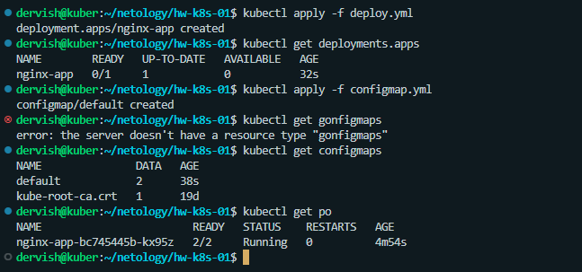
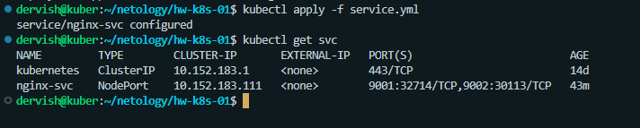
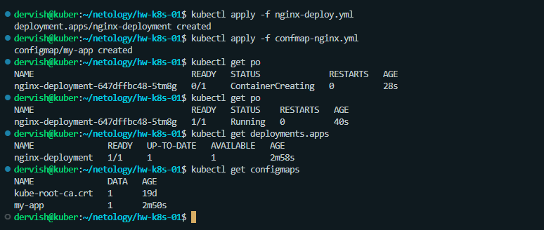
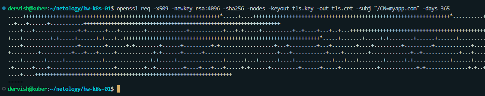
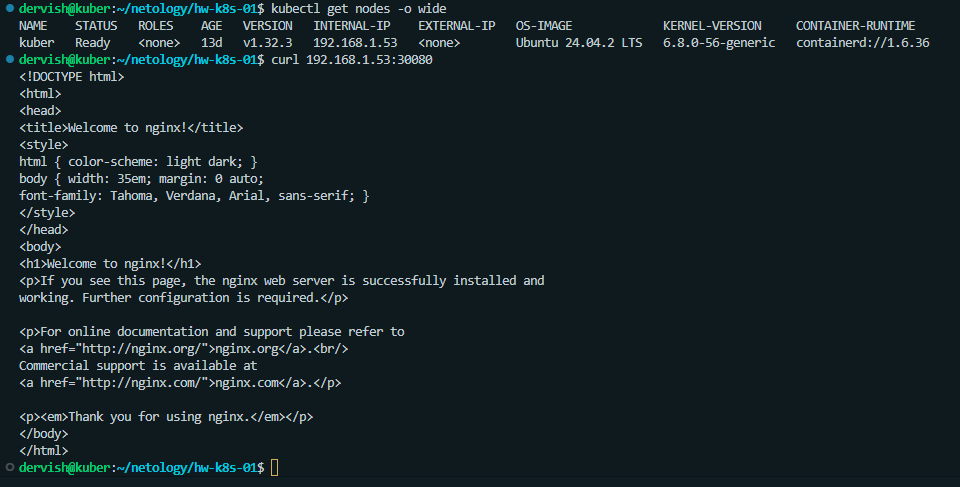

# Домашнее задание к занятию «Конфигурация приложений»

## Цель задания

В тестовой среде Kubernetes необходимо создать конфигурацию и продемонстрировать работу приложения.

## Чеклист готовности к домашнему заданию

    Установленное k8s-решение (например, MicroK8S).
    Установленный локальный kubectl.
    Редактор YAML-файлов с подключённым Git-репозиторием.

## Задание 1. Создать Deployment приложения и решить возникшую проблему с помощью ConfigMap. Добавить веб-страницу

Создать Deployment приложения, состоящего из контейнеров nginx и multitool.
Решить возникшую проблему с помощью ConfigMap.
Продемонстрировать, что pod стартовал и оба конейнера работают.

Сделать простую веб-страницу и подключить её к Nginx с помощью ConfigMap. Подключить Service и показать вывод curl или в браузере.

Предоставить манифесты, а также скриншоты или вывод необходимых команд.

>Ответ: [deploy.yml](./deploy.yml) [configmap.yml](./configmap.yml) [service.yml](./service.yml)

## Задание 2. Создать приложение с вашей веб-страницей, доступной по HTTPS

Создать Deployment приложения, состоящего из Nginx.
Создать собственную веб-страницу и подключить её как ConfigMap к приложению.

Выпустить самоподписной сертификат SSL. Создать Secret для использования сертификата.

>openssl req -x509 -newkey rsa:4096 -sha256 -nodes -keyout tls.key -out tls.crt -subj "/CN=myapp.com" -days 365

Создать Ingress и необходимый Service, подключить к нему SSL в вид. Продемонстировать доступ к приложению по HTTPS.

Предоставить манифесты, а также скриншоты или вывод необходимых команд.

>Ответ: [nginx-deploy.yml](./nginx-deploy.yml) [confmap-nginx.yml](./confmap-nginx.yml) [secret.yml](./secret.yml) [ingress.yml](./ingress.yml) [tls-service.yml](./tls-service.yml)
