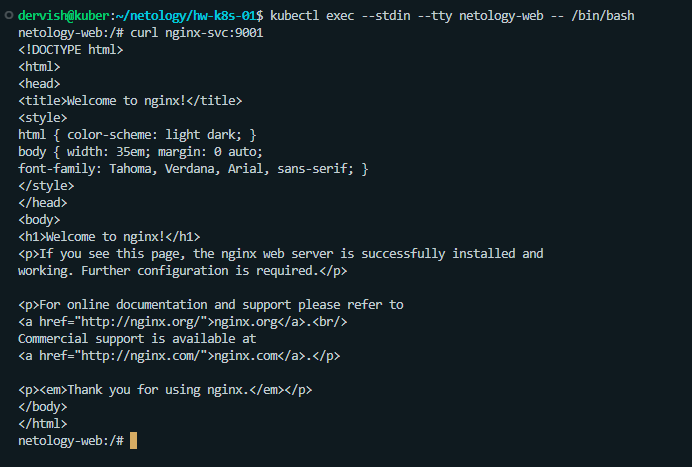
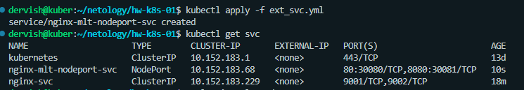

# Домашнее задание к занятию «Сетевое взаимодействие в K8S. Часть 1»

## Цель задания

В тестовой среде Kubernetes необходимо обеспечить доступ к приложению, установленному в предыдущем ДЗ и состоящему из двух контейнеров, по разным портам в разные контейнеры как внутри кластера, так и снаружи.

## Чеклист готовности к домашнему заданию

    Установленное k8s-решение (например, MicroK8S).
    Установленный локальный kubectl.
    Редактор YAML-файлов с подключённым Git-репозиторием.

## Задание 1. Создать Deployment и обеспечить доступ к контейнерам приложения по разным портам из другого Pod внутри кластера

Создать Deployment приложения, состоящего из двух контейнеров (nginx и multitool), с количеством реплик 3 шт.

>Ответ: [deploy.yml](./deploy.yml)

Создать Service, который обеспечит доступ внутри кластера до контейнеров приложения из п.1 по порту 9001 — nginx 80, по 9002 — multitool 8080.

>Ответ: [service.yml](./service.yml)

Создать отдельный Pod с приложением multitool и убедиться с помощью curl, что из пода есть доступ до приложения из п.1 по разным портам в разные контейнеры.

Продемонстрировать доступ с помощью curl по доменному имени сервиса.

Предоставить манифесты Deployment и Service в решении, а также скриншоты или вывод команды п.4.

>Ответ: [deploy.yml](./deploy.yml)  [service.yml](./service.yml)

## Задание 2. Создать Service и обеспечить доступ к приложениям снаружи кластера

Создать отдельный Service приложения из Задания 1 с возможностью доступа снаружи кластера к nginx, используя тип NodePort.

Продемонстрировать доступ с помощью браузера или curl с локального компьютера.

Предоставить манифест и Service в решении, а также скриншоты или вывод команды п.2.

>Ответ: [ext_svc.yml](./ext_svc.yml)