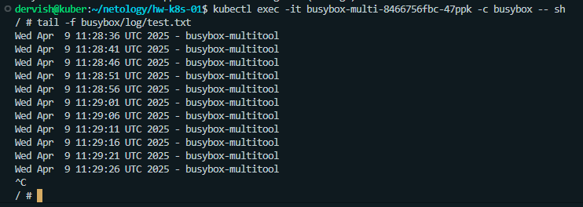

# Домашнее задание к занятию «Хранение в K8s. Часть 1»

## Цель задания

В тестовой среде Kubernetes нужно обеспечить обмен файлами между контейнерам пода и доступ к логам ноды.

## Чеклист готовности к домашнему заданию

    Установленное k8s-решение (например, MicroK8S).
    Установленный локальный kubectl.
    Редактор YAML-файлов с подключённым Git-репозиторием.

## Задание 1. Создать Deployment приложения, состоящего из двух контейнеров и обменивающихся данными.

Создать Deployment приложения, состоящего из контейнеров busybox и multitool.
Сделать так, чтобы busybox писал каждые пять секунд в некий файл в общей директории.
Обеспечить возможность чтения файла контейнером multitool.

Продемонстрировать, что multitool может читать файл, который периодически обновляется.

Предоставить манифесты Deployment в решении, а также скриншоты или вывод команды из п. 4.

>Ответ: [deploy.yml](./deploy.yml)

## Задание 2. Создать DaemonSet приложения, которое может прочитать логи ноды.

Создать DaemonSet приложения, состоящего из multitool.
Обеспечить возможность чтения файла /var/log/syslog кластера MicroK8S.
Продемонстрировать возможность чтения файла изнутри пода.

Предоставить манифесты Deployment, а также скриншоты или вывод команды из п. 2.

>Ответ: [daemonset.yml](./daemonset.yml)
