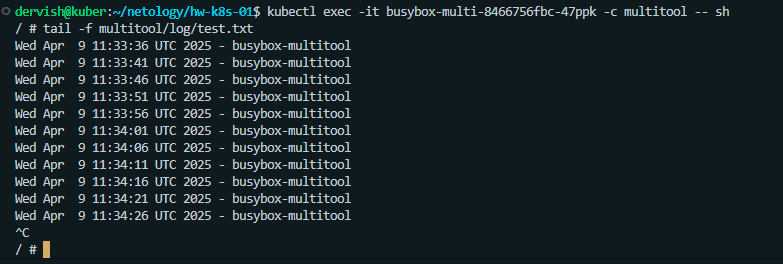
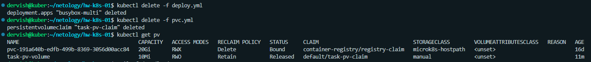
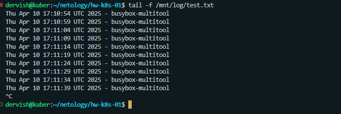
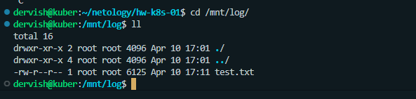
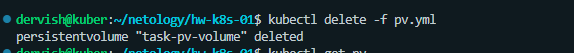
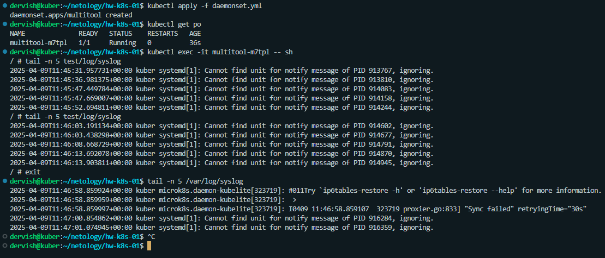

# Домашнее задание к занятию «Хранение в K8s. Часть 2»

## Цель задания

В тестовой среде Kubernetes нужно создать PV и продемострировать запись и хранение файлов.

## Чеклист готовности к домашнему заданию

    Установленное k8s-решение (например, MicroK8S).
    Установленный локальный kubectl.
    Редактор YAML-файлов с подключённым Git-репозиторием.

## Задание 1. Создать Deployment приложения, использующего локальный PV, созданный вручную.

Создать Deployment приложения, состоящего из контейнеров busybox и multitool.
Создать PV и PVC для подключения папки на локальной ноде, которая будет использована в поде.

Продемонстрировать, что multitool может читать файл, в который busybox пишет каждые пять секунд в общей директории.

Удалить Deployment и PVC. Продемонстрировать, что после этого произошло с PV. Пояснить, почему.

>Ответ: PV не привязывается к подам, нодам и кластеру, поэтому при их удалении он (PV) не удаляется и данные в нем сохраняются.

Продемонстрировать, что файл сохранился на локальном диске ноды. Удалить PV. Продемонстрировать что произошло с файлом после удаления PV. Пояснить, почему.

>Ответ: поскольку PV ReclaimPolicy имела значение Retain после удаления PV ресурсы автоматически не удалились

Предоставить манифесты, а также скриншоты или вывод необходимых команд.

>Ответ: [pv.yml](./pv.yml) [pvc.yml](./pvc.yml) [deploy.yml](./deploy.yml)

## Задание 2. Создать DaemonSet приложения, которое может прочитать логи ноды.

Создать DaemonSet приложения, состоящего из multitool.
Обеспечить возможность чтения файла /var/log/syslog кластера MicroK8S.
Продемонстрировать возможность чтения файла изнутри пода.

Предоставить манифесты Deployment, а также скриншоты или вывод команды из п. 2.

>Ответ: [daemonset.yml](./daemonset.yml)
