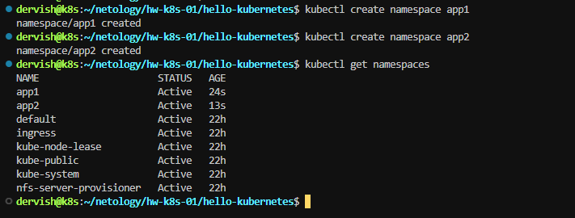

# Домашнее задание к занятию «Helm»

## Цель задания

В тестовой среде Kubernetes необходимо установить и обновить приложения с помощью Helm.

## Чеклист готовности к домашнему заданию

    Установленное k8s-решение (например, MicroK8S).
    Установленный локальный kubectl.
    Установленный локальный Helm.
    Редактор YAML-файлов с подключённым Git-репозиторием.

## Задание 1. Подготовить Helm-чарт для приложения

1. Необходимо упаковать приложение в чарт для деплоя в разные окружения.
2. Каждый компонент приложения деплоится отдельным deployment’ом или statefulset’ом.
3. В переменных чарта измените образ приложения для изменения версии.

>helm create hello-kubernetes-dev - создаем helm_chart

>[values.yaml](./hello-kubernetes-dev/values.yaml) [Chart.yaml](./hello-kubernetes-dev/Chart.yaml) [_helpers.tpl](./hello-kubernetes-dev/templates/_helpers.tpl)
>[deployment.yaml](./hello-kubernetes-dev/templates/deployment.yaml) [service.yaml](./hello-kubernetes-dev/templates/service.yaml) [serviceaccount.yaml](./hello-kubernetes-dev/templates/serviceaccount.yaml)

>то же самое делаем еще для двух чартов: hello-kubernetes-prod и hello-kubernetes-stage, различие чартов в версиях ПО

## Задание 2. Запустить две версии в разных неймспейсах

1. Подготовив чарт, необходимо его проверить. Запуститe несколько копий приложения.
2. Одну версию в namespace=app1, вторую версию в том же неймспейсе, третью версию в namespace=app2.
3. Продемонстрируйте результат.

